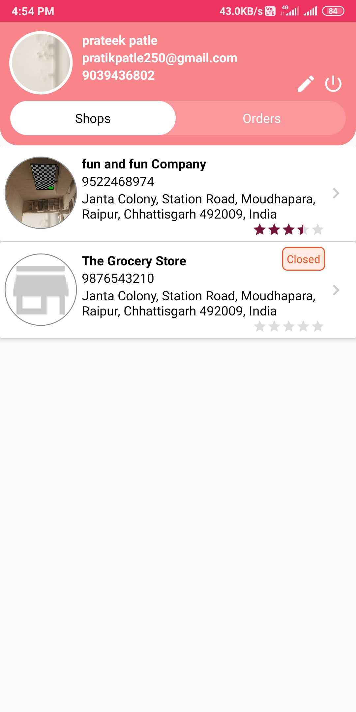
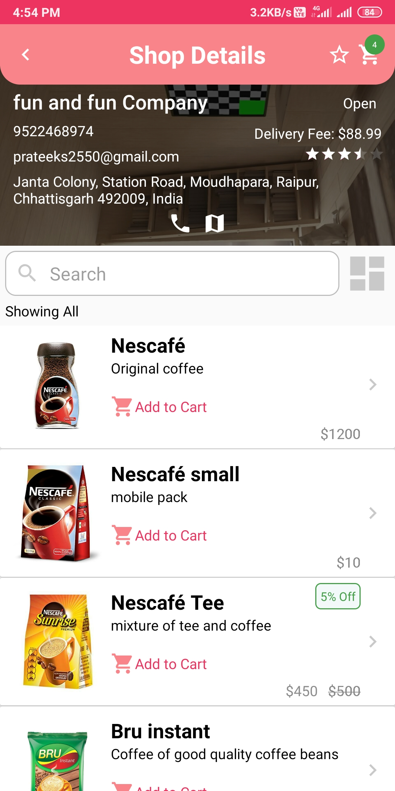
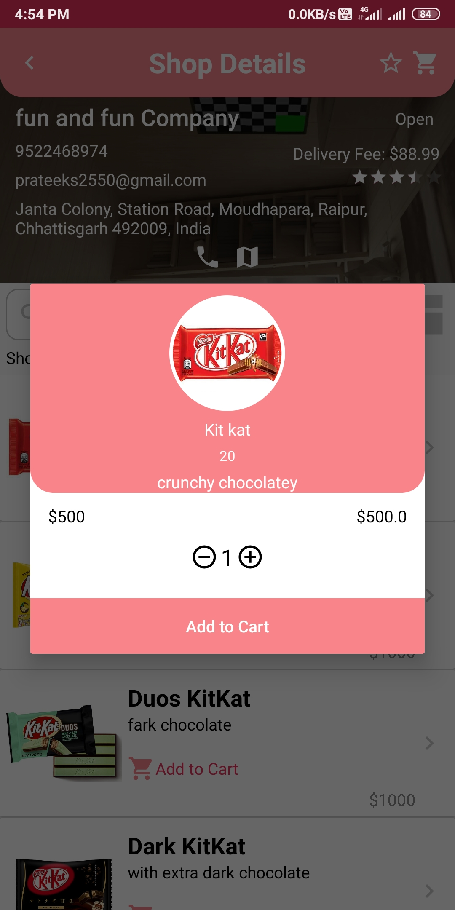
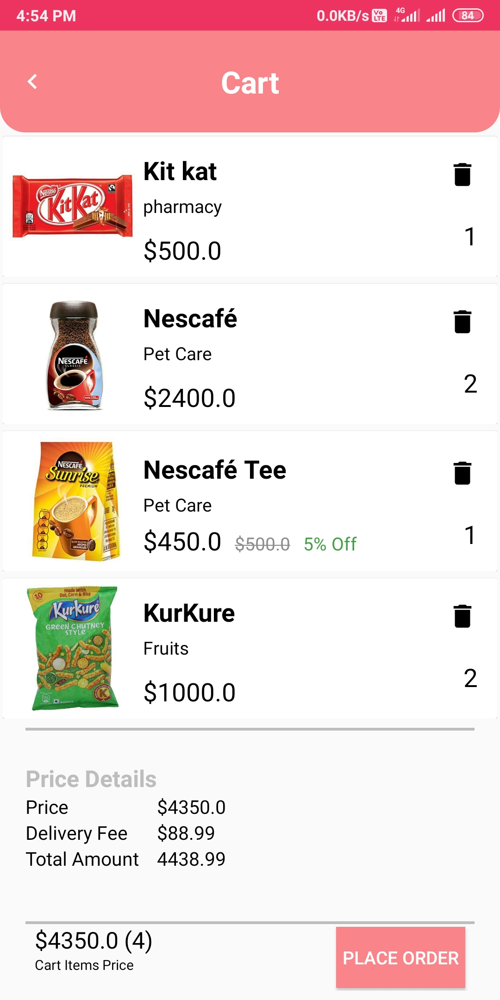
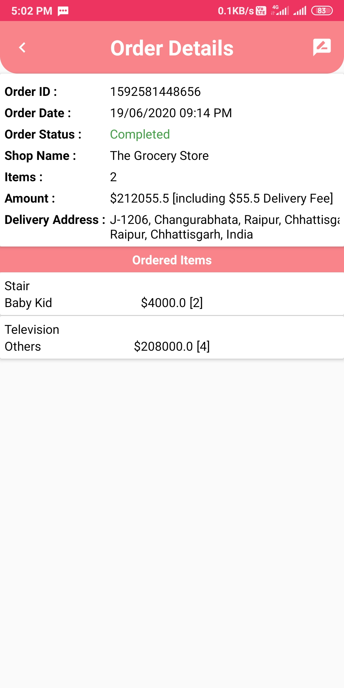
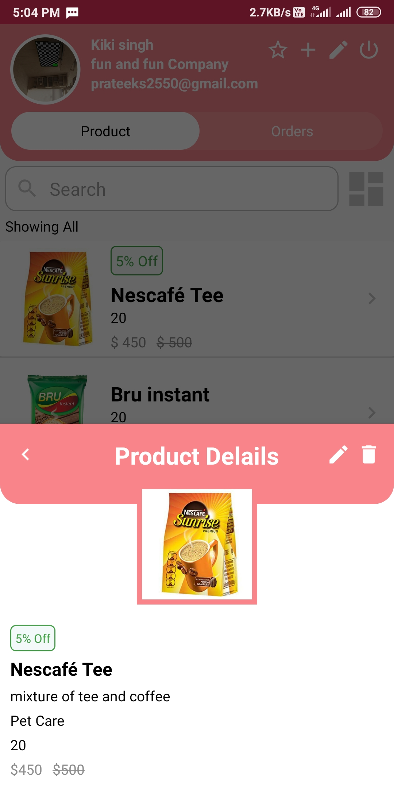
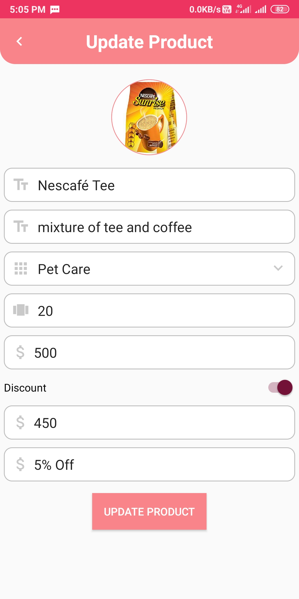

# Hello :wave:
Welcome to **GroxeryUp** Project. It is a E-grocery shop. 
An android application for buying grocery online from near by shops, In it seller are also able to register their shop. 
## Technology/ Stack used :mortar_board:
- Java 
- XML
- firebase
- Android Studio

## Screenshots :camera:

|                        Shop List                     |                        Product List                   |                       Shop List                       |
| :--------------------------------------------------: | :---------------------------------------------------: | :---------------------------------------------------: |
|                   |                    |                  |

|                         Cart                         |                        Order List                     |                      Shop Review                      |
| :--------------------------------------------------: | :---------------------------------------------------: | :---------------------------------------------------: |
|                    |                 |                 |

|                   Product Details Seller             |                Seller Add/Update products             |                                                       |
| :--------------------------------------------------: | :---------------------------------------------------: | :---------------------------------------------------: |
|               |                     |                      |

## APK :iphone:
[Apk link](https://drive.google.com/file/d/1Z2uGWXdqhYIySatzZamZ1dXoEPbhzhcM/view?usp=sharing)

## Features :clipboard:
**Buyer-**  
&nbsp;&nbsp;&nbsp;&nbsp;&nbsp;1.Able to view all the products available in store 
&nbsp;&nbsp;&nbsp;&nbsp;&nbsp;2.Manage list and add product to cart 
&nbsp;&nbsp;&nbsp;&nbsp;&nbsp;3.Know the status of orders 
&nbsp;&nbsp;&nbsp;&nbsp;&nbsp;4.Manage Orders 
&nbsp;&nbsp;&nbsp;&nbsp;&nbsp;5.Rate and review shops 
&nbsp;&nbsp;&nbsp;&nbsp;&nbsp;6.Search and sort procuct 
&nbsp;&nbsp;&nbsp;&nbsp;&nbsp;7.Watch open/close status of shop 
**Seller-**  
&nbsp;&nbsp;&nbsp;&nbsp;&nbsp;1.Add, remove and modify procucts 
&nbsp;&nbsp;&nbsp;&nbsp;&nbsp;2.Easily change price of any product 
&nbsp;&nbsp;&nbsp;&nbsp;&nbsp;3.Set discount and offer tag to any procuct 
&nbsp;&nbsp;&nbsp;&nbsp;&nbsp;4.Search and sort procuct 
&nbsp;&nbsp;&nbsp;&nbsp;&nbsp;5.Manage Orders 
